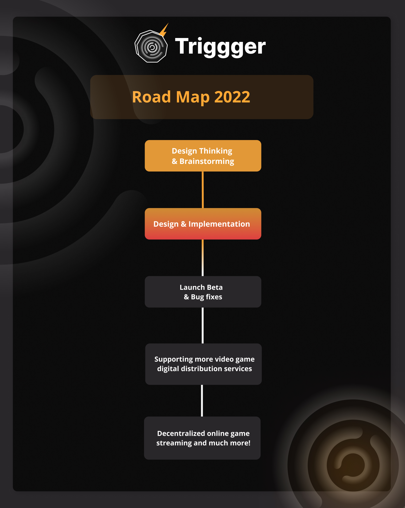

# Trigger Protocol

[](https://github.com/TriggerProtocol/trigger-protocol/blob/main/LICENSE) [](https://github.com/TriggerProtocol/trigger-protocol/issues) [](https://github.com/TriggerProtocol)

Trigger is a platform to onboard gamers and digital artists into the space of blockchain and web3 by creating their favorite game portals which allow buying and selling NFTs of your favorite games along with many other Defi features.


## Contents

- [What is Trigger Protocol?](#What-is-Trigger-Protocol?)
- [Getting Started](#Getting-Started)
- [Project Roadmap](#Project-Roadmap)
- [Live Demo](#Live-Demo)
- [Built With](#Built-With)
- [Contract Releases](#Contract-Releases)
- [Contributors](#Contributors)
- [License](#License)

## What is Trigger Protocol?

Trigger helps the awesome community of gamers and digital game artists and fan artists get exposure to the space of web3 and blockchain on the highly scalable and super fast Polygon Network. It also helps in creating a community of like-minded gamers and digital artists on the decentralized web!

## Benefits for Gamers 🎮️

- Gamers can easily create portals of their favorite games that they own on popular gaming stores such as Steam or the Epic Games Store etc! <br>
- Gamers can also mint NFTs corresponding to that particular game portal which can also help them earn value out of their art! <br>
- If a gamer is a portal owner then it allows the owner to earn from each buying and selling of NFTs inside that particular portal which they own! <br>
- Special features & NFTs for portal owners and gamers based on in-game achievements and rewards! <br>

## Benefits for Game Artists and Fans 🎨️

- Game artists and fans can join the game portals by buying or minting NFTs from a particular portal! <br>
- This will not only help them showcase their talent and affection towards their favorite games but also get to join the community of like-minded fans and game enthusiasts! <br>
- Artists and NFT holders can participate in NFT liquidity pools which have their own awesome benefits! <br>
- And at last of course buying and selling of NFTs which can hugely benefit NFT holders and Portal owners as well! <br>

## How Trigger Actually Works?

- Users will be able to log into our platform using their preferred way of authentication such as Steam or Epic Games etc. Once the user has logged in we will be able to get all the data of the games they own. <br>
- Owning games on any of these platforms allows exposure to whole new possibilities to users on our platform. <br>
- Users can create or join pre-existing game portals (there can be only one game portal for each game!) of their owned games which allows them to join the community and dive into the awesome NFTs inside that particular game portal. <br>
- Each game Portal is an NFT and there are two ways using which you can be the owner of a particular Portal NFT. You can either create the portal for a particular game (if it does not exist already) which allows you to be the owner or you already own the game. The 2nd way is by minting NFTs inside that portal which will allow users to own a fraction of that Portal NFT. <br>
- Being an owner of a Portal NFT has its own benefits. Each owner can earn __% from each transaction (buying/selling of NFTs) that occurs inside that portal. How much profit each owner earns from a transaction will depend on a particular factor that needs to be decided. By staking $TGR. <br>
- Artists and fans will mint NFTs inside the Portal which will of course be open for Buying/Selling. <br>
- NFT liquidity pools will allow users to deposit NFTs inside vaults in exchange for $aTGR, which can be swapped with any other coins in your preferred DEX. 

## Features 🌟️

- NFT Portals <br>
- Revenue for Portal Owners. <br>
- NFT Marketplace inside Portals. <br>
- NFT Liquidity Pools. <br>
- Platform for Artists & Gamers. <br>
- Low-Cost NFT Minting, thanks to Polygon! <br>

## Getting Started 

### <p> <b> Installing React dependencies and starting local server </b> </p>

```
git clone https://github.com/TriggerProtocol/trigger-protocol.git
cd client/
npm install
npm start
```

<p align="center">OR</p>

```
git clone git clone https://github.com/TriggerProtocol/trigger-protocol.git
cd client/
yarn install
yarn start
```

## Project Roadmap



## Live Demo

Our Official Website: [Paper-House.netlify.app/](https://github.com/TriggerProtocol/trigger-protocol).

## Built With

- [React](https://reactjs.org/) - React is a free and open-source front-end JavaScript library for building user interfaces or UI components.
- [Redux](https://redux.js.org/) - Redux is an open-source JavaScript library for managing application state.
- [Polygon (Matic Mumbai)](https://docs.matic.network/docs/develop/network-details/network/) - Mumbai Testnet replicates the Matic Mainnet, which is to be used for testing.
- [Metamask](https://metamask.io/) - MetaMask is a software cryptocurrency wallet used to interact with the Ethereum blockchain.
- [Portis](https://www.portis.io/) - Portis is a simplistic multi-blockchain wallet, which is designed to be easily set-up and connected to dApps.
- [The Graph](https://thegraph.com/) - The Graph is an indexing protocol for querying networks like Ethereum and IPFS. Anyone can build and publish open APIs, called subgraphs, making data easily accessible.
- [NFT Storage](https://nft.storage/) - Free decentralized storage and bandwidth for NFTs on IPFS and Filecoin.

## Contract Releases

- [Polygon Mumbai Testnet (80001)](https://mumbai.polygonscan.com)
- [View On Polygonscan](https://mumbai.polygonscan.com)

```json
{
  "80001": {
    "Trigger": "****************"
  }
}
```

## Contributors

<a href="https://github.com/TriggerProtocol/trigger-protocol/graphs/contributors">
  
</a>

## License

This project is licensed under the MIT License - see the [LICENSE](LICENSE) file for details.


# Basic Sample Hardhat Project

This project demonstrates a basic Hardhat use case. It comes with a sample contract, a test for that contract, a sample script that deploys that contract, and an example of a task implementation, which simply lists the available accounts.

Try running some of the following tasks:

```shell
npx hardhat accounts
npx hardhat compile
npx hardhat clean
npx hardhat test
npx hardhat node
node scripts/sample-script.js
npx hardhat help
```
```
TGR token Contract deployed to: 0x17790B1F18614E292Fa36D0F9bC3aD48DC189b52
xTGR token Contract deployed to: 0xA90e63D4EB334755aB9d57c5928A87617457B1C1
NFT token Contract deployed to: 0xC148783506b8f556Afe07bBbe2cc57744FcFb8a0
Trigger Protocol Contract deployed to: 0xFfE78A0cF80B24ff9b4F0a4530a6cdD31766C3a6

```
